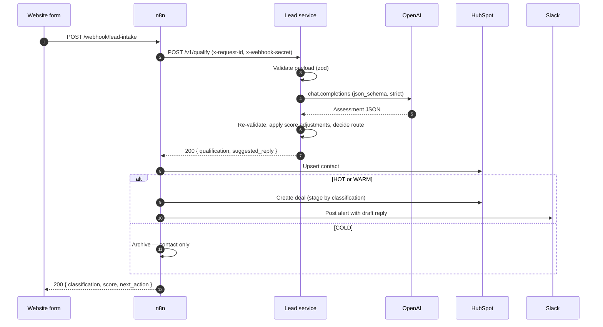

# Architecture

## Request flow



## Layers

```
        ┌──────────────────────────────────────────┐
        │  http/          Fastify, auth, status     │  knows about HTTP
        ├──────────────────────────────────────────┤
        │  pipeline/      qualifyLead, processLead  │  orchestration + reliability
        ├──────────────────────────────────────────┤
        │  ports/         LlmPort, CrmPort, …       │  interfaces only
        ├──────────────────────────────────────────┤
        │  domain/        schemas, scoring, routing │  no I/O, no dependencies
        └──────────────────────────────────────────┘
                              ▲
        adapters/  ───────────┘   implement ports; the only code that
                                  talks to OpenAI, HubSpot or Slack
```

Dependencies point inwards. `domain/` imports nothing from `adapters/`, which is
what makes the whole pipeline testable against fakes and lets a provider be
replaced by editing one file plus one line of `container.ts`.

`container.ts` is the only module that knows which concrete adapter is in play.

## The two use cases

**`qualifyLead`** — validate → assess → decide → draft. Pure with respect to
external state: no CRM write, no notification. Safe to call twice, safe to call
as a dry run, and the natural seam for an eval harness. This is what the n8n
workflow calls.

**`processLead`** — everything `qualifyLead` does, plus the CRM writes and the
notification. For callers who want one HTTP call instead of a workflow.

Both share the same decision code, so the two entry points can never disagree
about how a lead is routed.

<a id="scoring"></a>
## Scoring and routing

The model returns a score in 0..100. Deterministic adjustments are then applied
and the total is clamped back into range:

| Rule | Δ | Fires when |
| --- | --- | --- |
| `blocked_email_domain` | −100 | Sender's domain is on the blocklist |
| `negative_intent` | −100 | Message asks to unsubscribe or says not interested |
| `spam_marker` | −40 | Unambiguous spam phrasing (SEO services, backlinks) |
| `below_budget_floor` | −20 | Budget stated and below `MIN_QUALIFIED_BUDGET_EUR` |
| `free_email_no_company` | −15 | Free email provider and no company given |
| `high_budget` | +10 | Budget at or above `HIGH_BUDGET_EUR` |
| `low_effort_message` | −10 | Message under 25 characters |
| `solo_or_tiny` | −10 | Two employees or fewer |
| `below_icp_headcount` | −8 | Headcount stated and under 20 |
| `enterprise_headcount` | +5 | 100 employees or more |

Headcount penalties only fire when a headcount was actually given. A missing
field lowers confidence, not the score — otherwise every short form submission
would be punished for the form's design.

Classification, in order:

1. A hard stop (`blocked_email_domain`, `negative_intent`) → `COLD` / `archive`,
   whatever the score says.
2. Score ≥ `HOT_SCORE_THRESHOLD` (75) → `HOT` / `sales_call` — **unless** a
   budget was stated and falls below `MIN_QUALIFIED_BUDGET_EUR`, which
   downgrades to `WARM`. An *unstated* budget is not disqualifying.
3. Score ≥ `WARM_SCORE_THRESHOLD` (45) → `WARM` / `nurture_sequence`.
4. Otherwise → `COLD` / `archive`.

Both thresholds and both budget figures are environment configuration, so sales
can retune routing without a deploy. Boot fails if `WARM ≥ HOT`, which would
make one band unreachable.

## Idempotency

n8n, HubSpot forms and most marketing tools retry on timeout, so the same lead
regularly arrives more than once within seconds. Two independent guards:

- **Contacts** are keyed by email, normalised to lowercase and trimmed at the
  validation boundary. A repeat submission updates rather than duplicates.
- **Deals** are keyed by `idempotencyKey(lead)` — an FNV-1a hash of email plus
  normalised message, stored on the deal as `spesti_idempotency_key`. The
  adapter searches for it before creating anything.

This is why retrying the whole pipeline is safe, and why n8n's HTTP node can be
configured with `retryOnFail` without risk of duplicate deals.

## Observability

Structured JSON logs via pino, with lead name, email and message redacted by
default — the correlation id is enough to trace a request end to end without
putting personal data in a log aggregator.

The signal worth alerting on is `overrode_model`: the rate at which
deterministic rules disagree with the model. A sustained rise means the prompt
and the business rules have drifted apart, usually because one changed without
the other.
