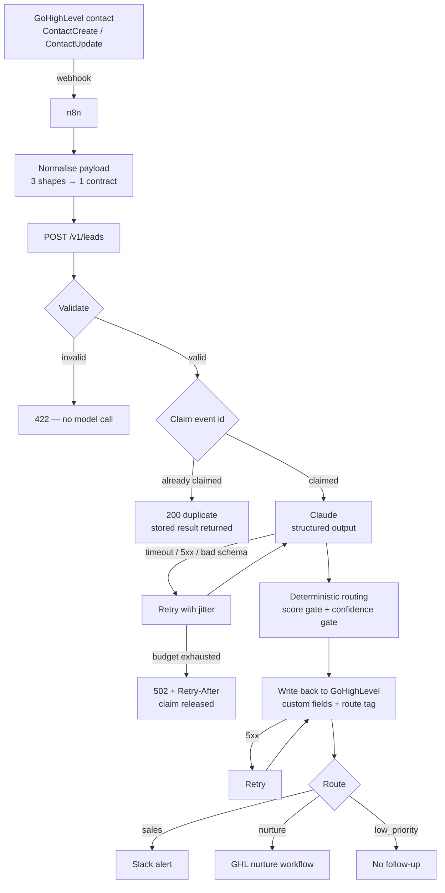

# Architecture



## Trust boundaries

1. **GoHighLevel** is the source of contact data and the destination for the
   qualification. It is trusted for facts about the contact, not for shape —
   its three webhook payloads disagree with each other.
2. **n8n** normalises and orchestrates. It holds credentials and decides what
   happens *after* a route is chosen; it does not decide the route.
3. **Claude** is untrusted for authorisation. It proposes a score, a confidence
   and its own label; none of those selects an action on their own.
4. **The routing policy** is the authority. Pure, deterministic, exhaustively
   tested.

## The invariant

> A confident Claude response can never select a route the policy would not
> have chosen — and an unconfident one can never get a lead archived.

Both halves are tested. The first is the obvious one. The second is the
interesting one: it is what stops a cautious model from quietly emptying the
pipeline.

## Layering

```
        ┌──────────────────────────────────────────┐
        │  server.ts        Fastify, auth, statuses │  knows HTTP
        ├──────────────────────────────────────────┤
        │  pipeline/        validate → claim → …    │  orchestration + retries
        ├──────────────────────────────────────────┤
        │  ports.ts         AssessorPort, CrmPort   │  interfaces only
        ├──────────────────────────────────────────┤
        │  domain/ policy/  schemas + routing rules │  no I/O, no dependencies
        └──────────────────────────────────────────┘
                              ▲
        adapters/  ───────────┘  Claude, GoHighLevel, and a fake for each
```

`domain/` and `policy/` import nothing from `adapters/`. That is what lets the
whole pipeline run against fakes with no key, and what makes swapping Claude for
another provider a one-file change.

## How this differs from project 01

Project 01 qualifies leads too, so the difference is worth stating plainly:

| | 01 — HubSpot | 03 — GoHighLevel |
| --- | --- | --- |
| Model | OpenAI, JSON-schema response format | **Claude**, `output_config.format` |
| CRM | HubSpot, contacts + deals | **GoHighLevel**, custom fields resolved by id per location, plus a route tag |
| Routing | Score thresholds and hard stops | **Score *and* confidence gates**, with a one-tier-drop rule |
| Idempotency | Deal-level, keyed on lead content | **Event-level, keyed on the GHL delivery id, claimed before the model call** |
| Failure focus | Degraded-mode scoring when the model is down | Claim release, so a transient CRM failure never strands a lead |

The shared idea — the model proposes, deterministic rules decide — is the point.
It is the thing worth showing twice against different stacks.
